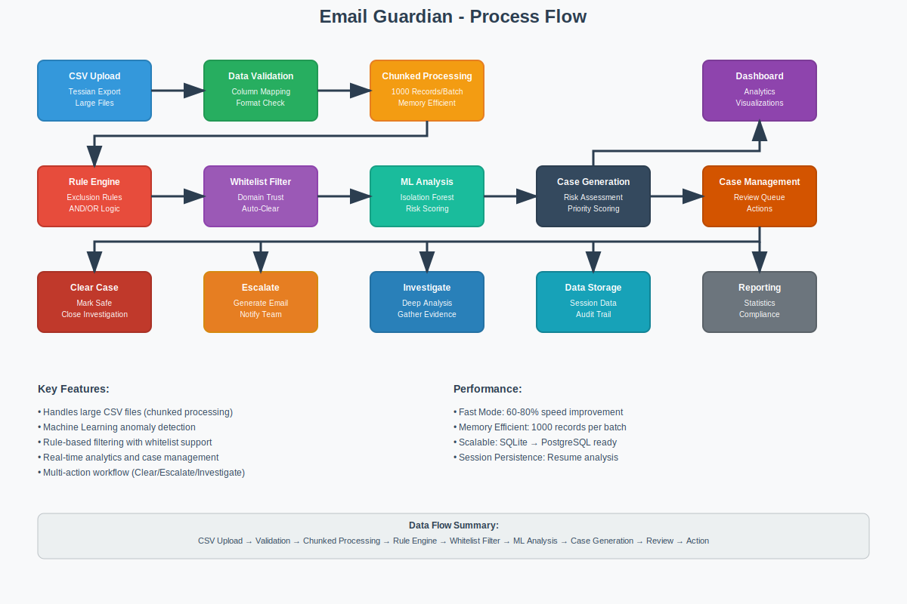

# Email Guardian - Service Specification

## Overview
Web-based email security analysis platform that processes exported email data to detect threats, data exfiltration, and anomalous communication patterns using rule-based filtering and machine learning.

## Core Capabilities

### Data Processing
- **CSV Import**: Handles large Tessian email exports with flexible column mapping
- **Chunked Processing**: 1000 records per batch for memory efficiency
- **Format Flexibility**: Adapts to various email export formats automatically
- **Session Management**: Persistent data storage with gzip compression for large datasets
- **Performance Mode**: Fast processing option (60-80% speed improvement)

### Threat Detection
- **Rule Engine**: Configurable business rules with complex AND/OR logic
- **ML Anomaly Detection**: Isolation Forest algorithm for pattern recognition
- **Risk Scoring**: Multi-dimensional assessment (0.0-1.0 scale) based on content, sender, and behavior
- **Domain Classification**: Automatic categorization (corporate, personal, public, suspicious)
- **Exclusion Filtering**: Pre-processing rules to filter out known-good communications

### Case Management
- **Active Cases**: Filtered view of emails requiring security review
- **Status Workflow**: Active → Cleared/Escalated status updates
- **Bulk Operations**: Select and process multiple cases simultaneously
- **Case Details**: Full email content, attachments, ML explanations, and risk scoring
- **Escalation Emails**: Generate security alert emails with case context and recommendations

### Analytics & Dashboards
- **Main Dashboard**: Real-time statistics with animated counters and ML insights
- **Sender Analysis**: Communication patterns and frequency analysis  
- **Time Analysis**: Temporal patterns and anomaly detection over time periods
- **Advanced ML Analytics**: BAU pattern analysis and attachment risk assessment
- **Whitelist Analytics**: Domain trust analysis and recommendation engine

### Administration
- **Rule Configuration**: Dynamic rule creation with regex support and testing
- **Whitelist Management**: Domain trust control with CSV import/export capability
- **Session Monitoring**: Upload tracking and processing status display
- **System Statistics**: Processing metrics, session counts, and performance data
- **Risk Algorithm Transparency**: ML scoring details and threshold documentation

## Technical Architecture
- **Backend**: Flask + SQLAlchemy + scikit-learn ML engine
- **Database**: SQLite (local) / PostgreSQL (production)
- **Frontend**: Bootstrap 5 + Chart.js + DataTables
- **Processing**: Chunked CSV handling (1000 records/batch)

## Key Endpoints
```
POST /upload                          # CSV file upload
GET  /cases/<session_id>              # Case management interface
GET  /dashboard/<session_id>          # Analytics dashboard  
POST /api/update_case_status          # Clear/escalate cases
GET  /admin                           # System administration
```

## Deployment
```bash
# Local Development
python local_run.py                   # SQLite, port 5000

# Production  
gunicorn --bind 0.0.0.0:5000 main:app # Requires DATABASE_URL
```

## Data Flow
CSV Upload → Data Validation → Chunked Processing → Rule Engine → Whitelist Filter → ML Analysis → Case Generation → Dashboard Analytics & Case Management → Actions (Clear/Escalate/Review)



The process flow diagram above accurately represents the implemented functionality, showing the complete pipeline from data upload through case management and final actions.

## Security Features
- Session-based data isolation
- Configurable rule engine (AND/OR logic)
- ML risk scoring (0.0-1.0 scale)  
- Domain whitelist/trust management
- Processing session tracking

## Performance
- Fast mode: 60-80% processing speed improvement
- Memory efficient: Chunked processing for large files
- Scalable: SQLite → PostgreSQL migration ready

## Target Users
Security teams, compliance officers, IT operations, digital forensics investigators